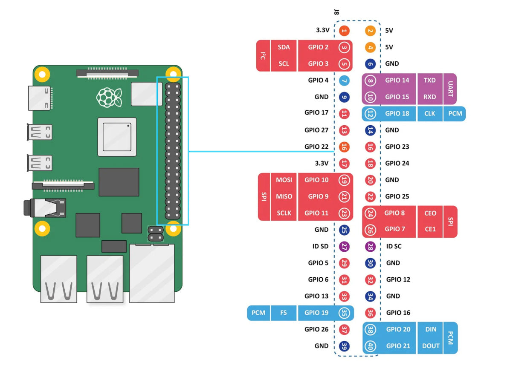

# AmazingHand — Sensors

## Files

| File | Description |
|---|---|
| `config.toml` | Shared config — GPIO pins, SPI settings, sensor channels, logging and visualisation defaults |
| `ads1256.py` | ADS1256 driver — 24-bit, 8-channel |
| `tactile_sensing.py` | `TactileSensor` wrapper — reads config.toml and drives the ADS1256 |
| `tactile_sensing_post_visualize.py` | Offline Bokeh visualisation of logged CSV data |
| `haptic_coin.py` | `HapticCoin` PWM class for the QYF-740 coin motor |

---

## FSR Tactile Sensing (ADS1256)

### Hardware

- **ADC HAT**: [Waveshare High-Precision AD HAT](https://www.waveshare.com/wiki/High-Precision_AD_HAT)
  - ADS1256: 24-bit, 8 single-ended channels, SPI
- **Sensors**: FSR (Force Sensitive Resistors) wired in a voltage-divider circuit with a fixed resistor (default 10 kΩ) to each ADC input channel.

### SPI Wiring (BCM pin numbers, set in `config.toml`)

| Signal | BCM | Pi header pin |
|---|---|---|
| MOSI (DIN) | GPIO 10 | Pin 19 |
| MISO (DOUT) | GPIO 9 | Pin 21 |
| SCLK | GPIO 11 | Pin 23 |
| CS | GPIO 22 | Pin 15 |
| RST | GPIO 18 | Pin 12 |
| DRDY | GPIO 17 | Pin 11 |

Enable SPI on the Pi:
```bash
sudo raspi-config  # Interface Options → SPI → Enable
```

### Install dependencies

```bash
pixi install
```

To add a single package interactively:

```bash
pixi add --pypi lgpio
```

### Run

**GUI (default):**
```bash
pixi run python -m Demo.Sensors.tactile_sensing
```

**Terminal only (no GUI window):**
```bash
pixi run python -m Demo.Sensors.tactile_sensing --terminal
```

See all flags:
```bash
pixi run python -m Demo.Sensors.tactile_sensing --help
```

### Offline Visualization

```bash
pixi run python Demo/Sensors/tactile_sensing_post_visualize.py
# or point at a specific file:
pixi run python Demo/Sensors/tactile_sensing_post_visualize.py --file Demo/Sensors/logs/tactile_20260101_120000.csv
```

CSV schema (long format — one row per channel per sample):

```
sensor_time, channel, raw, volts, force_norm
```

### Tuning `fsr_r_fixed`

The `fsr_r_fixed` parameter (default 10 000 Ω) must match the resistor you place in series with each FSR to form the voltage divider. Larger values increase sensitivity at low force; smaller values increase the measurable force range.

---

## Haptic Coin (QYF-740)

### Pin conflict warning

The ADS1256 tactile sensing stack claims the following BCM GPIO pins.  **Do not assign the HapticCoin to any of these:**

| BCM | Use |
|---|---|
| GPIO 8 | SPI0 CE0 (kernel) |
| GPIO 9 | SPI0 MISO |
| GPIO 10 | SPI0 MOSI |
| GPIO 11 | SPI0 SCLK |
| GPIO 17 | ADS1256 DRDY |
| GPIO 18 | ADS1256 RST |
| GPIO 22 | ADS1256 CS |
| GPIO 23 | ADS1256 CS_DAC |

Safe choices for the PWM output include GPIO 12, 13 (hardware PWM), 24, 25, 26, 27, or 35.

### Wiring — [RPi 5 pinout](https://vilros.com/pages/raspberry-pi-5-pinout)



| Motor wire | Pi pin |
|---|---|
| GND | Pin 6 |
| VCC | Pin 2 (5 V) |
| PWM | Pin 35 (GPIO 19) |

### Usage

```python
from Demo.Sensors.haptic_coin import HapticCoin

motor = HapticCoin(gpio_pin=19)
motor.vibrate_once(intensity=0.8, duration_s=0.5)
motor.cleanup()
```

Run the example test script as a module so relative imports resolve:

```bash
pixi run python -m Demo.Sensors.haptic_test
```
